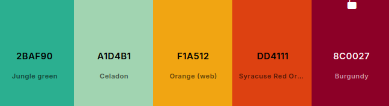
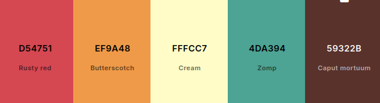
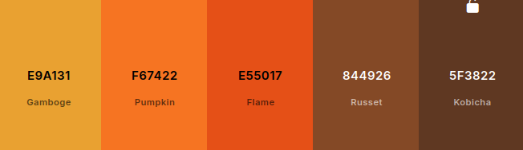
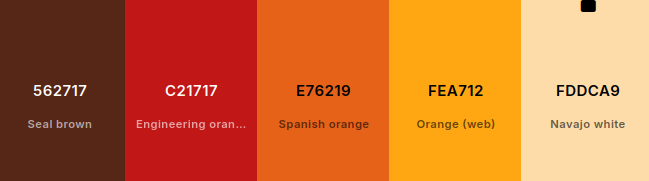
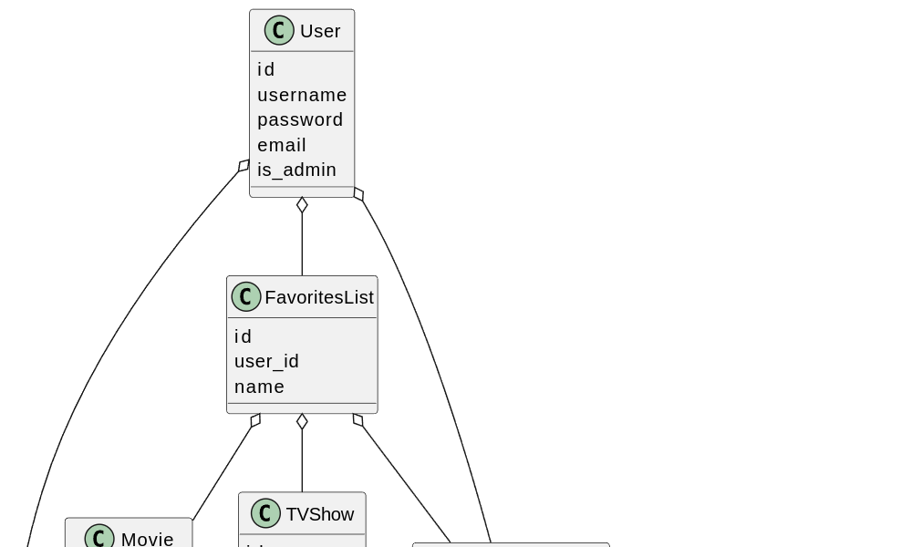
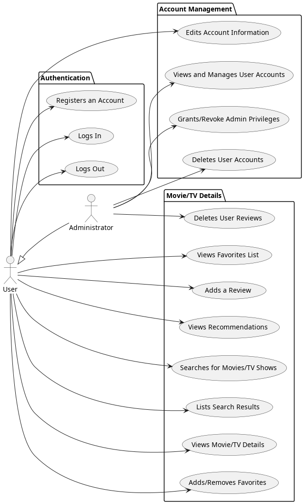
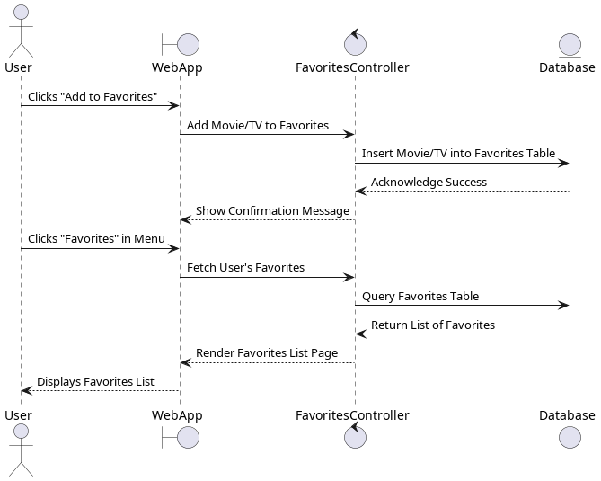

## Overview - COOL MOVIES APP ##

## Design

# Color Pallette

airport



cupcake



earth_fire



highway



## Classes



## Model 



## User Stories ##

<!-- Describe the **user stories** for the project, ensuring each includes clear **acceptance criteria** and a **point estimate**. The **user stories** must align with the **use case diagram** and should be referred to as US#1, US#2, etc.  -->

## US #1 - User Registration and Authentication
- As a user, I want to create an account with a secure password so that I can access the web-app's features. When I fill in the required account information (username, password) I want to hit a 'Submit' button which confirms that my account has been created.

POINTS: 

## US #2 - Login and Logout
- As a user, I want to login and log out securely. On the landing page, I want to be able to hit the 'Log In' button where the system will autheticate my information and upon success, direct me to the main page of the website. When I hit the 'Log Out' button, I want the system to log my account, returning me to the landing page. 

POINTS:

## US #3 - User Account Control
- As a user, I want to be able to click an "Account" link to be directed to a page that dsplays my account information. I want to be able to edit my password and account picture on this page.

POINTS:

## US #4 - Administrator Account Control
- As an administrator, I want to be able to click a button that takes me to a page that displays all active user accounts for the website. I want to be able to toggle users to also be adminstrators. I want to be able to delete user accounts on this page as well, with a confirmation window popping up to confirm before deletion. 

POINTS:

## US #5 - Search Movies/TV
- As a user, I want to be able to search either movies or TV shows by title, genres, rating, and release date. When I click the search button after specifying search parameters, I wish to view a list of my filtered results (see US#6)

POINTS:

## US #6 - List Filtered Movies/TV
- After a successful search, I want to be able to view a list of movies or tv shows based on those search parameters. 

POINTS:

## US #7 - Movie/TV Object Page
- As a user, after a successful search and viewing the list of search results, I want to click a tv/movie and be directed to a page that shows more info on that object. This page would show  information such as a key image, title, release information, and average rating.  

POINTS:

## US #8 - User Favorites List
- As a user, I want to be able to click a button within the Movie/TV Object Page that will either add or remove that movie/tv object to a favorites list. When I click the "Favorites" button in the menu bar, I want to be directed to a page that shows me my favorites list. 

POINTS:

## US #9 - Movie/TV User Review
- As a user, when I'm viewing a page for a Movie/TV Show, I want to be able to fill a field that allows me to add a 1-5 star rating and a short review for that movie. When this review is added, it displays it in a running column within the page for that Movie/TV show. 

- As an administrator, I want to bee able to delete user reviews from their respective page, by clicking an 'X' next to each review that is only visible to administrators. 

POINTS:

## US #10 - Movie/TV Recommendation Page
- As a user, I want to click a "Recommendations" button that directs me to a page that will recommend me Movies/TV shows based on my favorites list. I want to be able to specify if I want these recommendations to be either high or lower rated. 

POINTS:

## PROPOSED USER STORIES ##

## US #11 - Random Button
- As a user, I want to click a "Random" button that will give me a random Movie/TV Recommendation, directing me to the object page for that title. 

## US #12 - Social Lists
- As a user, I want to be able to view a users profile by clicking on their name when it appears under a review or discussion. On their profile page, I can their favorites list.

## US #13 - Movie/TV Discussions
- As a user, I want to be able to view a discussion thread in each movie/tv object page. I want to contribute or start a discussion by entering text into a field and hitting a "Submit" button. 

## US #14 - Director/Actor page
- As a user, I want to be able to click the name of an Actor/Director, and visit a page

## Sequence Diagram

US #8 Sequence - User Favorites List



# Development Process 

<!-- This section should describe, in general terms, how Scrum was used in this project. Include a table summarizing the division of the project into sprints, the user story goals planned for each sprint, the user stories actually completed, and the start and end dates of each sprint. You may also add any relevant observations about the sprints as you see fit.

|Sprint#|Goals|Start|End|Done|Observations|
|---|---|---|---|---|---|
|1|US#1, US#2, ...|mm/dd/23|mm/dd/23|US#1|...|

As in Project 2, you should take notes on the major sprint meetings: planning, daily scrums, review, and retrospective. Use the scrum folder and the shared templates to record your notes.
 -->
# Testing 

<!-- In this section, share the results of the tests performed to verify the quality of the developed product, including the test coverage in relation to the written code. There is no minimum code coverage requirement, but ensure there is at least some coverage through one white-box test and one black-box test. -->

# Deployment 
<!-- 
The final product must demonstrate the integrity of at least 5 out of the 6 planned user stories. It should be packaged as a Docker image and be deployable using:

```
docker compose up
``` -->
